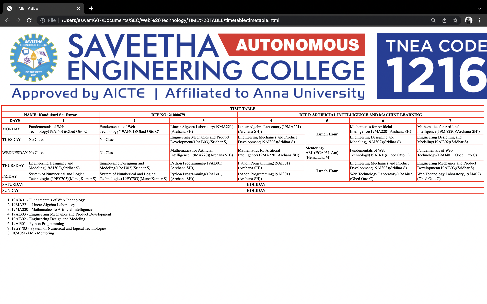

# Experiment_Time_Table

## AIM
To Write a html webpage page to display your timetable.

# ALGORITHM
### STEP 1
create a simple table using table tag
### STEP 2
Add header row using th tag
### STEP 3
Add your timetable
### STEP 4
Execute the program

# CODE
<!DOCTYPE html>
<html>
<head>
 <title>TIME TABLE</title>
</head>
	
 <body>
      <table border = "1" cellspacing="1" bordercolor="red" bgcolor="white">

         <tr>
            <th colspan="8">TIME TABLE</th>
         </tr>
<tr>
            <th colspan="2"> NAME: Kandukuri Sai Eswar
            <th colspan="2"> REF NO: 21000679
            <th colspan="4"> DEPT: ARTIFICIAL INTELLIGENCE AND MACHINE LEARNING</th>
</tr>
         <tr>
            <th>DAYS</th>
            <th>1</th>
            <th>2</th>
            <th>3</th>
             <th>4</th>
            <th>5</th>
            <th>6</th>
            <th>7</th>
         </tr>
         <tr>
             <td>MONDAY</td>
             <td>Fundementals of Web Technology(19AI401)(Obed Otto C)</td>
             <td>Fundementals of Web Technology(19AI401)(Obed Otto C)</td>
             <td>Linear Algebra Laboratory(19MA221)(Archana SH)</td>
             <td>Linear Algebra Laboratory(19MA221)(Archana SH))</td>
             <th rowspan="2">Lunch Hour</th>
             <td>Mathematics for Artificial Intelligence(19MA220)(Archana SH))</td>
             <td>Mathematics for Artificial Intelligence(19MA220)(Archana SH))</td>
         </tr>
         <tr>
             <td>TUESDAY</td>
             <td>No Class</td>
             <td>No Class</td>
             <td>Engineering Mechanics and Product Development(19AI303)(Sridhar S)</td>
             <td>Engineering Mechanics and Product Development(19AI303)(Sridhar S)</td>
             <td>Engineering Designing and Modeling(19AI302)(Sridhar S)</td>
             <td>Engineering Designing and Modeling(19AI302)(Sridhar S)</td>
         </tr>
         <tr>
            <td>WEDNESDAY</td>
             <td>No Class</td>
             <td>No Class</td>
             <td>Mathematics for Artificial Intelligence(19MA220)(Archana SH))</td>
             <td>Mathematics for Artificial Intelligence(19MA220)(Archana SH))</td>
             <td>Mentoring-AM1(ECA051-Am)(Hemalatha M)</td>
             <td>Fundementals of Web Technology(19AI401)(Obed Otto C)</td>
             <td>Fundementals of Web Technology(19AI401)(Obed Otto C)</td>
         </tr>
         <tr>
             <td>THURSDAY</td>
             <td>Engineering Designing and Modeling(19AI302)(Sridhar S)</td>
             <td>Engineering Designing and Modeling(19AI302)(Sridhar S)</td>
             <td>Python Programming(19AI301)(Archana SH))</td>
             <td>Python Programming(19AI301)(Archana SH))</td>
             <th rowspan="2">Lunch Hour</th>
             <td>Engineering Mechanics and Product Development(19AI303)(Sridhar S) </td>
             <td>Engineering Mechanics and Product Development(19AI303)(Sridhar S)</td>
         </tr>
         <tr>
             <td>FRIDAY</td>
             <td>System of Numberical and Logical Technologies(19EY703)(ManojKumar S)</td>
             <td>System of Numberical and Logical Technologies(19EY703)(ManojKumar S)</td>
             <td>Python Programming(19AI301)(Archana SH))</td>
             <td>Python Programming(19AI301)(Archana SH))</td>
             <td>Web Technology Laboratory(19AI402)(Obed Otto C)</td>
             <td>Web Technology Laboratory(19AI402)(Obed Otto C)</td>
         </tr>
         <tr>
             <td>SATURDAY</td>
             <th colspan="7">HOLIDAY</th>
         </tr>
         <tr>
             <td>SUNDAY</td>
             <th colspan="7">HOLIDAY</th>
         </tr>
  
         </table>
       
     <ol>
         <li>19AI401 - Fundamentals of Web Technology</li>
         <li>19MA221 - Linear Algebra Laboratory</li>
         <li>19MA220 - Mathematics fo Artificial Intelligence</li>
         <li>19AI303 - Engineering Mechanics and Product Development</li>
         <li>19AI302 - Engineering Design and Modeling</li>
         <li>19AI301 - Python Programming</li>
         <li>19EY703 - System of Numerical and logical Technologies</li>
         <li>ECA051-AM - Mentoring</li>
     </ol>
   </body>
</html>
</body>
</html>

# OUPUT
